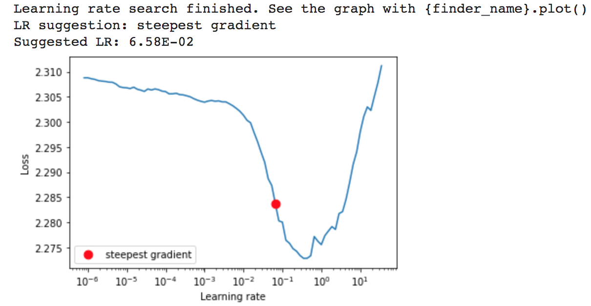

```
from torch_lr_finder import LRFinder
import torch.nn as nn
import torch.optim as optim

def get_best_lr_sgd(model, trainloader, lr=1e-7, momentum=0.9, end_lr=100, num_iter=100):
    """
    Tweaked version from fastai
    
    Increases the learning rate in an exponential manner and computes the training loss for each learning rate. 
    lr_finder.plot() plots the training loss versus logarithmic learning rate.
    """
    criterion = nn.CrossEntropyLoss()
    optimizer = optim.SGD(model.parameters(), lr=lr, momentum=momentum)
    lr_finder = LRFinder(model, optimizer, criterion, device="cuda")
    lr_finder.range_test(trainloader, end_lr=end_lr, num_iter=num_iter)
    lr_finder.plot() # to inspect the loss-learning rate graph
    return lr_finder
    # lr_finder.reset() # to reset the model and optimizer to their initial state
    
from configs import basic_config
from torch.optim.lr_scheduler import StepLR
from torch.optim.lr_scheduler import ReduceLROnPlateau

def get_steplr_scheduler(optimizer, **lr_scheduler_paras):
    return StepLR(optimizer, step_size=lr_scheduler_paras['step_size'], gamma=lr_scheduler_paras['gamma'])

def get_reducelronplateau_scheduler(optimizer, **lr_scheduler_paras):
    return ReduceLROnPlateau(optimizer, 
                            mode=lr_scheduler_paras['mode'],
                            factor=lr_scheduler_paras['factor'],
                            patience=lr_scheduler_paras['patience'],
                            threshold=lr_scheduler_paras['threshold'],
                            threshold_mode=lr_scheduler_paras['threshold_mode'],
                            cooldown=lr_scheduler_paras['cooldown'],
                            min_lr=lr_scheduler_paras['min_lr'],
                            eps=1e-08, 
                            verbose=False)

def get_lr(optimizer):
    for param_group in optimizer.param_groups:
        return param_group['lr']
        
lr_finder.get_best_lr_sgd(model_temp, train_loader, lr=1e-7, momentum=0.9, end_lr=100, num_iter=100)
```  
**README On LRs:**

We implemented a method **get_best_lr_sgd** which takes the inputs [model, trainloader, lr=1e-7, momentum=0.9, end_lr=100, num_iter=100] and process them
using **LRFinder** and returns lr_finder object & plots the graph between **learning rates** and **Loss** as below.



And also we implemented a method **get_reducelronplateau_scheduler** which takes the inputs [optimizer, mode, factor, patience, threshold, threshold_mode, cooldown,
min_lr] and process them using **ReduceLROnPlateau**

To get the best validation accuracies of the model, we tried to tune the learning rate and ReduceLROnPlateau parameters [factor, patience, cooldown].

When we ran lr_finder for multiple times we got below suggested best LRs

- 1.52E-01
- **1.00E-01**
- **6.58E-02**
- **1.00E-01**
- **1.00E-01**
- **5.34E-02**
- **6.58E-02**
- **5.34E-02**
- 2.31E-01

Out of these, we tried frequently suggested LRs 1.00E-01, 6.58E-02 and - 5.34E-02 with various combinations of ReduceLROnPlateau parameters.
