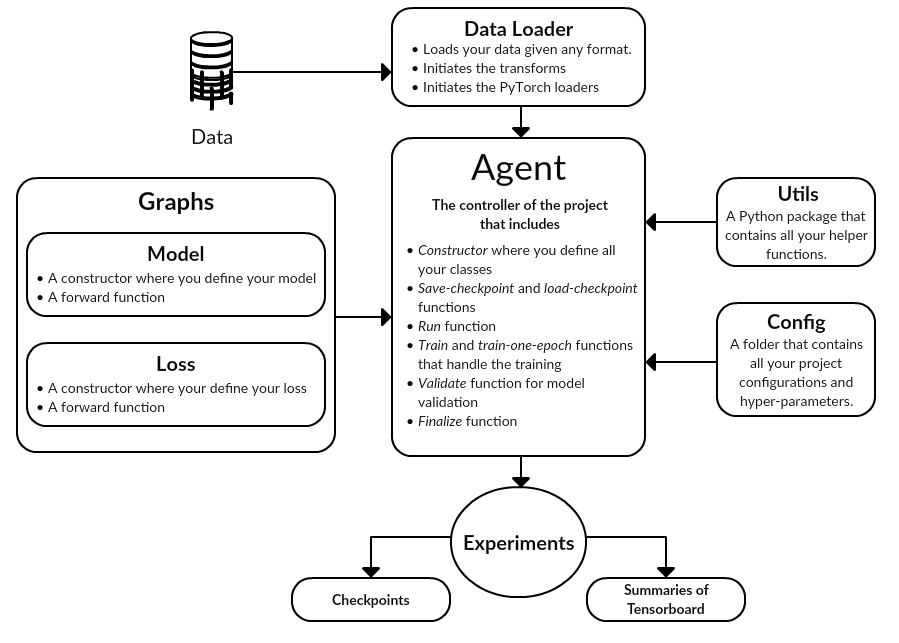

Resources:

- https://github.com/moemen95/Pytorch-Project-Template 

  - A Scalable template for PyTorch projects, with examples in Image Segmentation, Object classification, GANs and Reinforcement Learning.
  - Article on the above project template - https://www.linkedin.com/pulse/pytorch-project-template-do-smart-way-hager-rady/
  

- https://github.com/victoresque/pytorch-template
